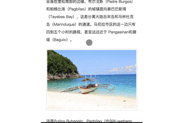

# hexo-lazyload | [中文文档](./readme.chinese.md)

**hexo-lazyload** is a hexo plugin which is use IntersectionObserver api to improve the performance of lazy-load images.

feature:

- auto generate thumbnail（include remote image and local image）
- use IntersectionObserver api(with polyfill if browsers not support) for lazyload
- medium effect



## Getting started

This package rely on `gm` to generate thumbnail, so first download and install [GraphicsMagick](http://www.graphicsmagick.org/) or [ImageMagick](http://www.imagemagick.org/). In Mac OS X, you can simply use Homebrew and do:

```bash
brew install imagemagick
brew install graphicsmagick
```

then, install this package:

```bash
$ npm install hexo-lazyload --save

// or

$ yarn add hexo-lazyload
```

## Usage

First add configuration in `_config.yml` from your hexo project.

```yaml
lazyload:
  enable: true
  # thumbPath: '/images/thumb'
  # className: #optional e.g. .J-lazyload-img
  # loadingImg: #optional eg. /images/loading.png
```

**thumbPath**
- absolute thumb path ,root dir is `public/`, default: `/images/thumb`

**loadingImg**
- default: '/js/lazyload-plugin/loading.svg'
- If you want to customize the image, just fill the path. don't forget to copy the image to your themes folder.

**className**
- by default, lazy-load all post images.
- if not null, only lazy-load the images with this className(with '#' for ID or '.' for className). (P.S. hexo && markdown support html syntax.)


Run hexo command.

```bash
$ hexo clean && hexo g
```

## Demo

[robin-front.github.io](https://robin-front.github.io)

## TODO

- [x] lazy-load
- [x] medium effect
- [x] generate thumbnail(local & remote)
- [x] hash thumbnail name
- [x] custom thumbnail path
